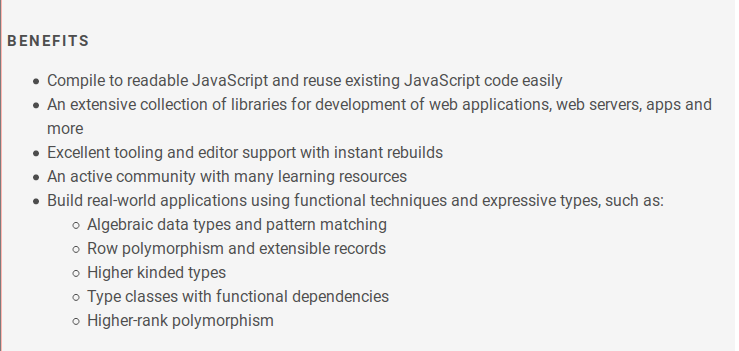
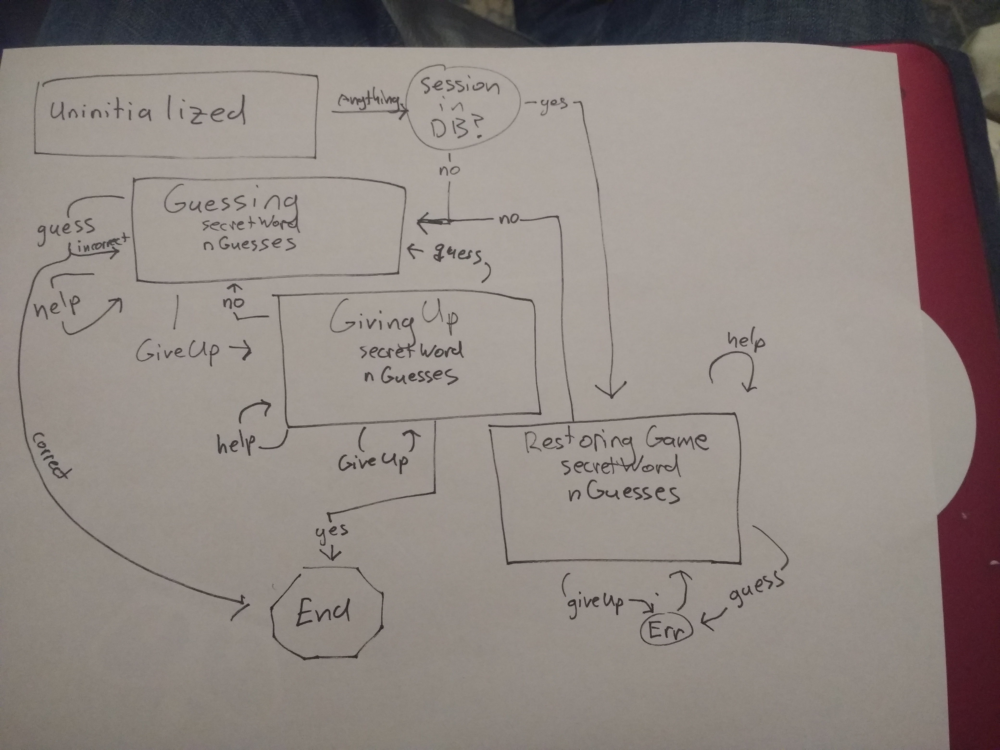

# Using Purescript to help Alexa take over the world

## Richard Marmorstein

#### Twitter: @twitchard
#### Github: github.com/twitter

---
# The future
---

# The future
### - Alexa is the future.

---

# The future

### - Alexa is the future.
### - Purescript is the future.

---

## Why is Alexa the future?

---

## Why is Alexa the future?

### Smart Speakers
#### - 75% of US households by 2020

---

## Why is Alexa the future?

### Smart Speakers
#### - 75% of US households by 2020
#### - or maybe 55% by 2021, depends on who you ask

---

## Why is Alexa the future?

### Smart Speakers
#### - 75% of US households by 2020
#### - or maybe 55% by 2021, depends on who you ask
#### - Amazon has 70% of the market

---

## Other smart speakers

### - Google Home - 24%
### - Apple "HomePod"
### - Harman Kardon/Microsort "Invoke" speaker
### - Samsung, soon...
### - Facebook, soon...
### - Open Source: Mycroft

---

## Smart speakers are taking over the world

---

## Smart speakers are taking over the world

### It's exciting for two reasons:
---

## Smart speakers are taking over the world

### It's exciting for two reasons:

#### - Talking to your computer is cool.
---

## Smart speakers are taking over the world

### It's exciting for two reasons:

#### - Talking to your computer is cool.
#### - Accessibility
---

## Why is Purescript the future?

---
## Why is Purescript the future?

### One reason:
---

## Why is Purescript the future?

### One reason: The New York Purescript Meetup
---

## Why is Purescript the future?

### One reason: The New York Purescript Meetup

### A great destiny awaits all of you
---

## Back to Earth

---

## Back to Earth

### What's in store?

#### 1. Quick demo of 'Secret Word'
#### 2. The anatomy on an Alexa Skill
#### 3. The Alexa Skill Ecosystem
#### 4. Why Purescript is great for Alexa Skills
#### 5. Why Richard enjoys Purescript
#### 6. Why Richard struggles with Purescript
#### 7. Libraries: purescript-alexa and purescript-alexa-template

---

## Secret word

### - Based off a game called Jotto.
### - You say "Alexa, open secret word"
### - Alexa randomly picks a five-letter English word for you to guess.
### - You guess some five-letter word.
### - Alexa tells you how many letters in your guess are also in the secret word.
###  - You keep going until you guess the secret word, or you give up.

---

## Anatomy of an Alexa Skill
### Invocation name
#### - 2+ words (unless you have a one-word trademark)
#### - No articles

---

## Anatomy of an Alexa Skill
### Invocation name
#### - 2+ words (unless you have a one-word trademark)
#### - No articles

#### LaunchRequest: "Alexa, open secret word"
#### IntentRequest: "Alexa, tell secret word to start a new game"

---

## Session

#### Open a skill
#### Keep interacting with it
#### Don't have to keep saying "Alexa, tell secret word..."

---

## Session

#### Open a skill
#### Keep interacting with it
#### Don't have to keep saying "Alexa, tell secret word..."
#### Alexa persists "session attributes" throughout the "session"

---
## Session Attributes

```purescript
type Session = Maybe SessionRec
type SessionRec =
  { secretWord :: String
  , guesses :: Array String
  , status :: Status
  }
data Status = Normal | GivingUp | Loading
-- GivingUp = we just asked, are you sure you want to give up?
-- Loading = we just asked, do you want to pick up from
--           where we left off last time?
```

---
## Intents

### Represent the users input to your skill?
### You define your skill's intents.
```purescript
[ "AMAZON.CancelIntent"
, "AMAZON.HelpIntent"
, "AMAZON.StopIntent"
, "AMAZON.YesIntent"
, "AMAZON.NoIntent"
, "GuessIntent"
, "GiveUpIntent"
, "SpellingIntent"
, "ThinkingIntent"
]
```
### You provide "sample utterances" for custom intents

---

## Sample Utterances
```purescript
  -- For GuessIntent
  [ "Guess {Word}"
  , "I guess {Word}"
  , "My guess is {Word}"
  , "How about {Word}"
  ]
```

---

## Slots
#### - Use a slot to capture a variable part of a users input.
#### - "I guess {Word}" -- {Word} represents a slot

---
## Slots

#### - Use a slot to capture a variable part of a users input.
#### - "I guess {Word}" -- {Word} represents a slot
#### - Slots have types
#### - Built-in: AMAZON.NUMBER, AMAZON.DURATION, or define your own
---
## Slots

#### - Use a slot to capture a variable part of a users input.
#### - "I guess {Word}" -- {Word} represents a slot
#### - Slots have types
#### - Built-in: AMAZON.NUMBER, AMAZON.DURATION, or define your own
#### - But the types are lies!
#### - My favorite day of the week is pizza
---

## Output
  
## You give Alexa some text, she says it

---

## Output
  
## You give Alexa some text, she says it

## Time out after 8 seconds.
---

## Output
  
## You give Alexa some text, she says it

## Time out after 8 seconds.
 
## But you can set a "reprompt" for another 8 seconds.

---

## SSML

#### Hints for Alexa to pronounce things
```
<speak>
You say, <phoneme alphabet="ipa" ph="pɪˈkɑːn">pecan</phoneme>. 
I say, <phoneme alphabet="ipa" ph="ˈpi.kæn">pecan</phoneme>.
</speak> 
```
#### Or make Alexa whisper
```
<speak>
I want to tell you a secret. 
<amazon:effect name="whispered">
    I am not a real human.
</amazon:effect>.
Can you believe it?
</speak>
```

---

## SSML

#### Or embed .mp3 files
```
<speak>
  Welcome to Car-Fu. 
  <audio src="https://carfu.com/audio/carfu-welcome.mp3" /> 
  You can order a ride, or request a fare estimate. 
  Which will it be?
</speak> 
```
#### (90 second limit)

---
## Cards

#### Show on the Alexa App

---
## Cards

#### Show on the Alexa App

#### Shows on the Echo Show
---

## Cards

#### Show on the Alexa App

#### Shows on the Echo Show

#### Can have text and images

#### No hyperlinks

---

## Linking

#### Do oauth to link an Alexa user with a user in another system


---
## AudioPlayer/VideoPlayer

#### I know little about this -- but it exists!

---
## Dialog Model

#### I know little about this -- but it exists!
---

## Skill Store / Alexa App / Metadata

#### Title
#### Description
#### Example utterances
#### Usage instructions

[Secret Word on the skill store](https://www.amazon.com/dp/B078VJZ6F2)

---
## Deployment

#### Your own servers (https)

#### Or, use AWS Lambda (easier)

---
## Deployment

#### Your own servers (https)

#### Or, use AWS Lambda (easier)

#### Free tier, or promo credit if you get popular
---

## Deployment

#### Your own servers (https)

#### Or, use AWS Lambda (easier)

#### Free tier, or promo credit if you get popular

#### It is your destiny
---
    
# The Alexa Skill Ecosystem

---

## ask-cli

#### Intents, slots, sample utterances, instructions, metadata...
#### All live in .json

---
## ask-cli

#### Intents, slots, sample utterances, instructions, metadata...
#### All live in .json
#### If you want, generate them from purescript!
---
## ask-cli

#### Intents, slots, sample utterances, instructions, metadata...
#### All live in .json
#### If you want, generate them from purescript
### Deploying is easy!
```sh
ask deploy
```
#### If you use lambda, it deploys your code too
---

## Skill Simulator
[demo here](https://developer.amazon.com/alexa/console/simulator/edw/amzn1.ask.skill.46ee761e-a8b2-403a-89fe-93dbb2a05c60/development/en_US/)

---

## Skill dashboard
[demo here](https://developer.amazon.com/edw/home.html#/analytics/amzn1.ask.skill.fe3eeb2f-f7eb-4be5-bcd6-076532ec60cb/live)

---

## Why is Purescript a good choice for an Alexa Skill?

---

## Why is Purescript a good choice for an Alexa Skill?

#### Well-supported by AWS Lambda
---

## Why is Purescript a good choice for an Alexa Skill?



---

## Algebraic Data Types

---

## Algebraic Data Types

### - Let you make invalid states unrepresentable
```
data Output
  = JustCard Card
  | JustSpeech
      { speech :: Speech
      , reprompt :: Maybe Speech
      }
  | SpeechAndCard
      { speech :: Speech
      , reprompt :: Maybe Speech
      , card :: Card
      }
```
---

## Algebraic Data Types

#### - Let you "make invalid states unrepresentable"
```
data Output
  = JustCard Card
  | JustSpeech
      { speech :: Speech
      , reprompt :: Maybe Speech
      }
  | SpeechAndCard
      { speech :: Speech
      , reprompt :: Maybe Speech
      , card :: Card
      }
```
#### - Enums are better than magic strings.
#### - Similarly, ADTs are better than loosely typed objects.
---

## Pattern matching

---

## Pattern matching
### ADTs helped eliminate invalid states
### Pattern matching helps group the remaining space of valid states concisely
```
hasReprompt :: Output -> Boolean
hasReprompt JustSpeech { reprompt : Just _ } = true
hasReprompt SpeechAndCard { reprompt : Just _ } = true
hasReprompt _ = false
```
#### Compiler catches if the patterns you match aren't exhaustive

#### This enables "fill-in-the-blank" development

---

## What does this have to do with Alexa?

---
## What does this have to do with Alexa?

### - Alexa Skills have a lot of corner cases:
- What if a slot is missing or an unexpected value?
- What if the user says "Pizza" in response to a yes or no question?
- What if the user says "yes" not in response to a yes or no question?
- What if the user invokes an intent before the session has been initialized?
#### - The purescript compiler = great tool for being exhaustive

---

## An Alexa skill is a state machine

### The state of the machine is the "Session"

### The inputs to the state machine are the "intents & slots"

---

---
## An Alexa skill is a state machine

#### - Every combination of origin state and input must be covered

#### - Writing a table would be exhaustive, but redundant and error-prone

#### - Pattern matching can do it succinctly

---
## The Secret Word State Machine

```purescript
run (ErrorInput err) Nothing = errorAndExit
run (ErrorInput err) sess    = errorAndContinue sess
run _ Nothing                = beginOrRestoreGame
run Launch _                 = beginOrRestoreGame
run Stop _                   = exit
run Cancel _                 = exit

run No  (Just sess@{status : Loading}) = beginNewGame
run Yes (Just sess@{status : Loading}) = restoreGame sess
run _   (Just sess@{status : Loading}) = errorAndContinue sess

run Yes (Just sess@{status : GivingUp}) = playerLoses sess
run No  (Just sess@{status : GivingUp}) = promptForGuess sess
run _   (Just sess@{status : GivingUp}) = errorAndContinue sess

run Yes (Just sess) = errorAndContinue sess
run No (Just sess)  = errorAndContinue sess

run Help          (Just sess) = readInstructionsAndContinue sess
run (Guess guess) (Just sess) = handleGuess guess sess
run Thinking      (Just sess) = handleThinking sess
run GiveUp        (Just sess) = confirmGivingUp sess
run SessionEnded  (Just sess) = persistSession sess
```
---

## What did Richard like about Purescript

#### - Fast feedback loop

---

## What did Richard like about Purescript

#### - Fast feedback loop

#### - Clear Milestones

---

## What did Richard like about Purescript

#### - Fast feedback loop

#### - Clear Milestones

#### - Demanding compiler

---

## What did Richard like about Purescript

#### - Fast feedback loop

#### - Clear Milestones

#### - Demanding compiler

#### - Tooling

---

## What did Richard struggle with

#### - The Vim plugin is rough around the edges

---

## What did Richard struggle with

#### - The Vim plugin is rough around the edges

#### - The learning curve is steep
---

## What did Richard struggle with

#### - The Vim plugin is rough around the edges

#### - The learning curve is steep

#### - There are lots of distractions


( Invented by [Lucas Di Cioccio](dicioccio.fr) )
---
## What did Richard struggle with

#### - The reading material/documentation is short on *examples*

---


## purescript-alexa
  - Type definitions for
    * AlexaRequest (the input into your skill)
    * AlexaResponse (the output of your skill)
    * SkillManifest (defines invocation name, info for skill store)
    * LanguageModel (defines intents and slots)
    * The type definitions are incorrect
  - Helper for making the `exports.handler = function (event, context, callback) {...}`
  - Lenses
  - Sum type for built-in intents

---

## purescript-alexa-template
  - Much more useful
  - Clone it today!
  - Demo?

---

## Thank you!

twitter: @twitchard
github: github.com/twitchard
